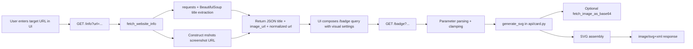

# `site-preview`

Generate dynamic, embeddable SVG website preview badges from a URL in seconds.

[](#)
[](#tech-stack--architecture)
[](#tech-stack--architecture)
[](LICENSE)

> [!NOTE]
> This repository implements a website preview badge service (not a general-purpose logging framework). The README below documents the current production behavior and architecture of this codebase.

---

## Table of Contents

- [Features](#features)
- [Tech Stack \\& Architecture](#tech-stack--architecture)
  - [Project Structure](#project-structure)
  - [Key Design Decisions](#key-design-decisions)
- [Getting Started](#getting-started)
  - [Prerequisites](#prerequisites)
  - [Installation](#installation)
- [Testing](#testing)
- [Deployment](#deployment)
- [Usage](#usage)
- [Configuration](#configuration)
- [License](#license)
- [Contacts \\& Community Support](#contacts--community-support)

---

## Features

- URL-to-SVG rendering pipeline for generating rich link preview cards.
- Dual API design:
  - `GET /info` for normalized metadata (`title`, screenshot URL, canonical URL).
  - `GET /badge` for generated `image/svg+xml` output.
- Automatic website title extraction via HTML parsing (`<title>` fallback logic).
- Screenshot sourcing through WordPress `mshots` endpoint for remote page previews.
- Customizable visual output controls:
  - Width, optional fixed height, border radius, border width/color.
  - Title text color/opacity and title plate color/opacity.
  - Title placement modes: `overlay_top`, `overlay_bottom`, `outside_top`, `outside_bottom`.
  - Image scale and X/Y offsets for framing adjustments.
  - Optional custom title override.
- Optional thumbnail embedding as Base64 data URI for self-contained SVGs.
- Frontend generator UI with live controls, i18n support, and copy-ready embed snippets.
- Multi-format output snippets: Markdown, HTML, and raw URL.
- Safe query handling with typed parsing and value clamping (`safe_int`, `safe_float`).
- Cross-origin friendly response headers for API consumption.
- Short-term cache headers on badge responses for CDN/browser efficiency.

> [!TIP]
> Use the `custom_title` query parameter when target pages have weak or noisy `<title>` metadata.

---

## Tech Stack & Architecture

### Core Stack

- **Backend**: Python + Flask
- **HTTP/Data**: `requests`, `urllib.parse`, `urllib.request`
- **HTML Parsing**: `beautifulsoup4`
- **Rendering**: Programmatic SVG composition in pure Python
- **Frontend**: Vanilla HTML/CSS/JavaScript (ES modules)
- **Localization**: File-based JS locale dictionaries under `i18n/locales`
- **Deployment Target**: Serverless-compatible Python API routes (Vercel config present)

### Project Structure

<details>
<summary>Expand full repository tree</summary>

```text
site-preview/
├── api/
│   ├── card.py              # SVG composition + optional thumbnail embedding
│   └── index.py             # Flask app, static routes, /info and /badge APIs
├── i18n/
│   ├── index.js             # Translation exports
│   ├── keys.js              # Shared i18n keys
│   └── locales/
│       ├── cs.js
│       ├── de.js
│       ├── en.js
│       ├── es.js
│       ├── fr.js
│       ├── ja.js
│       ├── kk.js
│       ├── nl.js
│       ├── pl.js
│       ├── pt.js
│       ├── ru.js
│       ├── sv.js
│       ├── uk.js
│       └── zh.js
├── app.js                   # UI behavior and request orchestration
├── index.html               # UI shell
├── styles.css               # UI styles
├── requirements.txt         # Python dependencies
├── vercel.json              # Hosting/runtime config
└── LICENSE
```

</details>

### Key Design Decisions

- **Stateless generation**: Card rendering is request-time and deterministic from query parameters.
- **Pure-SVG output**: Ensures embed compatibility in README/platform contexts.
- **Resilience-first metadata lookup**: Fail-soft behavior on title fetch/screenshot failure.
- **Parameter guardrails**: Width, radius, opacities, and similar values are range-constrained.
- **Frontend/backend contract**: UI maps one-to-one with `/badge` query parameters.

<details>
<summary>Request/data flow diagram</summary>



</details>

> [!IMPORTANT]
> The screenshot source is an external service dependency. Production reliability and latency are partly coupled to external screenshot availability.

---

## Getting Started

### Prerequisites

- Python `3.10+` (recommended `3.11+`)
- `pip` for dependency installation
- Network egress for remote metadata/screenshot fetches

### Installation

```bash
git clone https://github.com/readme-SVG/readme-SVG-site-preview.git
cd readme-SVG-site-preview
python -m venv .venv
source .venv/bin/activate  # Windows: .venv\Scripts\activate
pip install -r requirements.txt
```

Run locally with Flask:

```bash
export FLASK_APP=api/index.py
export FLASK_ENV=development
flask run --host 0.0.0.0 --port 5000
```

Open: `http://localhost:5000`

<details>
<summary>Troubleshooting and source-build notes</summary>

### Common startup issues

1. **`ModuleNotFoundError`**
   - Confirm virtualenv is activated.
   - Re-run `pip install -r requirements.txt`.

2. **Timeouts on remote sites**
   - Some target websites block automated fetchers or respond slowly.
   - Retry with a different URL and verify outbound connectivity.

3. **SVG displays "No Image"**
   - The screenshot endpoint may not yet have generated a shot.
   - Wait and refresh; UI already triggers short auto-refresh cycles.

4. **Locale assets not loading**
   - Ensure `/i18n/<path>` route is reachable in your runtime.

### Alternate run command

```bash
python -m flask --app api/index.py run --host 0.0.0.0 --port 5000
```

</details>

---

## Testing

> [!WARNING]
> This repository currently has no committed unit/integration test suite. Use the checks below as baseline validation until formal tests are added.

Recommended local checks:

```bash
python -m compileall api
python -m flask --app api/index.py run --port 5000
curl "http://127.0.0.1:5000/info?url=https://example.com"
curl -I "http://127.0.0.1:5000/badge?url=https://example.com"
```

Suggested future automation:

- Unit test parameter guards (`safe_int`, `safe_float`).
- Snapshot/semantic tests for generated SVG fragments.
- Integration tests for `/info` and `/badge` response contracts.

---

## Deployment

- Keep runtime stateless and horizontally scalable.
- Place API behind CDN where possible to cache badge responses.
- Ensure egress is allowed to target websites and screenshot source.
- Configure observability and rate limiting at edge/proxy layer.

### Minimal production checklist

1. Build image/runtime with locked dependencies.
2. Enforce request timeout ceilings and upstream retry policy.
3. Add reverse-proxy cache for `/badge` responses.
4. Configure CORS policy according to your consumer surface.

<details>
<summary>Containerization baseline (example)</summary>

```dockerfile
FROM python:3.11-slim
WORKDIR /app
COPY requirements.txt .
RUN pip install --no-cache-dir -r requirements.txt
COPY . .
EXPOSE 5000
CMD ["python", "-m", "flask", "--app", "api/index.py", "run", "--host=0.0.0.0", "--port=5000"]
```

```yaml
services:
  site-preview:
    build: .
    ports:
      - "5000:5000"
    restart: unless-stopped
```

</details>

---

## Usage

### Basic Usage

Generate a default preview badge:

```bash
curl "http://127.0.0.1:5000/badge?url=https://example.com" -o badge.svg
```

Embed in Markdown:

```md
[](https://example.com)
```

Embed in HTML:

```html
<a href="https://example.com" target="_blank" rel="noopener">
  
</a>
```

<details>
<summary>Advanced Usage</summary>

### Custom style request

```bash
curl "http://127.0.0.1:5000/badge?url=https://example.com&width=480&height=270&radius=12&border_width=2&border_color=3b82f6&title_color=ffffff&title_opacity=1&plate_color=111827&plate_opacity=0.72&title_position=overlay_bottom&image_scale=1.15&image_offset_x=0&image_offset_y=-8&custom_title=Production%20Landing%20Page"
```

### Title position modes

- `overlay_top`
- `overlay_bottom`
- `outside_top`
- `outside_bottom`

### Edge cases to account for

- Remote site responds but has empty/invalid `<title>`.
- Screenshot unavailable or delayed.
- Aggressive query values (negative/overflow) are clamped.
- Very long titles are wrapped and truncated to max lines.

</details>

---

## Configuration

Runtime behavior is controlled primarily through query parameters.

| Parameter | Type | Default | Range / Allowed | Description |
|---|---|---:|---|---|
| `url` | string | required | valid URL | Target website to render. |
| `width` | int | `320` | `200..1000` | Card width in px. |
| `height` | int | `0` | `>=0` | Card total height in px (`0` = auto). |
| `radius` | int | `10` | `0..30` | Card border radius. |
| `title_color` | hex string | `ffffff` | hex | Title text color. |
| `title_opacity` | float | `1.0` | `0.0..1.0` | Title text alpha. |
| `plate_color` | hex string | `0f1117` | hex | Title plate color. |
| `plate_opacity` | float | `0.78` | `0.0..1.0` | Title plate alpha. |
| `title_position` | enum | `overlay_bottom` | position enums | Where title plate renders. |
| `border_width` | int | `1` | `0..10` | Outer stroke width. |
| `border_color` | hex string | `ffffff` | hex | Outer stroke color. |
| `image_scale` | float | `1.0` | `>=0.1` | Screenshot zoom factor. |
| `image_offset_x` | int | `0` | integer | Horizontal pan. |
| `image_offset_y` | int | `0` | integer | Vertical pan. |
| `custom_title` | string | empty | free text | Overrides fetched page title. |
| `embed` | bool-like | `true` | `true`/`false` | Inline embed screenshot as data URI. |

> [!CAUTION]
> With `embed=true`, SVG payload size may increase significantly because raster image bytes are base64-embedded.

<details>
<summary>Reference request templates</summary>

### Metadata API

```http
GET /info?url=https://example.com
```

### Badge API (minimal)

```http
GET /badge?url=https://example.com
```

### Badge API (fully customized)

```http
GET /badge?url=https://example.com&width=480&height=270&radius=12&title_color=ffffff&title_opacity=1&plate_color=0f1117&plate_opacity=0.78&title_position=overlay_bottom&border_width=2&border_color=ffffff&image_scale=1.05&image_offset_x=0&image_offset_y=0&custom_title=My%20Service&embed=true
```

</details>

---

## License

This project is distributed under the **MIT License**. See [`LICENSE`](LICENSE) for full terms.

---

## Contacts & Community Support

## Support the Project

[](https://www.patreon.com/OstinFCT)
[](https://ko-fi.com/fctostin)
[](https://boosty.to/ostinfct)
[](https://www.youtube.com/@FCT-Ostin)
[](https://t.me/FCTostin)

If you find this tool useful, consider leaving a star on GitHub or supporting the author directly.
